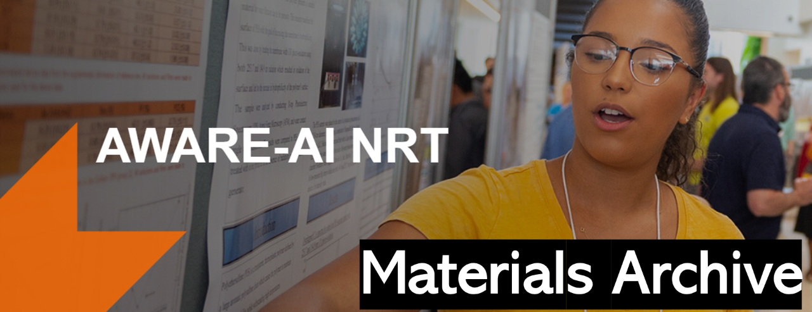

# [AWARE-AI](https://www.rit.edu/nrtai/)
This repository belongs to the AWARE-AI community at RIT and contains links to select AWARE-AI program materials.

Program website:  [AWARE-AI NRT](https://www.rit.edu/nrtai/)  

For details please contact: <awareainrt@rit.edu>

Link to the AWARE-AI Video Archive: https://www.youtube.com/channel/UCxA5yRbu1oroinBaEkBFr6Q

## Table of contents

### Quick Links

1. [AWARE-AI Dataset Archive](#aware-ai-database)
2. [CHAI Seminar Series](#chai-seminar-series)
3. [Coursework](#coursework)
4. [Hackathon](#hackathon)
5. [Internships](#internships)
6. [Lab Rotations](#lab-rotations)
7. [Mentor Cafe](#mentor-cafe)
8. [MSI Visits](#msi-visits)
9. [Multi-day Events](#multi-day-events)
10. [Poster Presentation](#poster-presentation)
11. [Roundtables on Advanced Topics](#roundtable)
12. [Seed Funding](#seed-funding)
13. [Workshops](#workshops)

### AWARE-AI Database

<table>
  <tr>
    <th>S.No</th>
    <th>Description</th>
    <th>Links</th>
  </tr>

  <tr>
    <td>1.</td>
     <td>Dataset Archive Submission Form</td>
     <td><a href="Materials Archive/AWARE-AI Database/Datasetarchiveform052423.pdf">Link</a></td>
  </tr>
   <tr>
</table>

### CHAI Seminar Series

<table>
  <tr>
    <th>S.No</th>
    <th>Date</th>
    <th>Speaker</th>
    <th>Topics</th>
    <th>Links</th>
  </tr>

  <tr>
    <td>1.</td>
    <td>02-23-2022</td>
    <td>Yulia Tsvetkov</td>
    <td>Towards Language Generation we can Trust</td>
    <td><a href="https://github.com/sm3533/AWARE-AI/blob/990997616b4e86af1c690766e6b172533dea2758/Materials%20Archive/CHAI%20Seminar/AWAREAI_%5BCHAI-YuliaTsvetkov%5D_0222.pdf">Link</a></td>
  </tr>

 <tr>
    <td>2.</td>
    <td>02-28-2022</td>
    <td>Matus Telgarsky</td>
    <td>Approximation, Optimization, and Generalization in Deep Networks</td>
    <td><a href="https://github.com/sm3533/AWARE-AI/blob/904a5b4bf5263a9efe3ad57d060f97ca15dd8778/Materials%20Archive/CHAI%20Seminar/AWAREAI_%5BCHAI-Matus%20Telgarsky%5D_0222.pdf">Link</a></td>
  </tr>

  <tr>
    <td>3.</td>
    <td>03-14-2022</td>
    <td>Celal Savur</td>
    <td>A Physiological Computing System to Improve Human-Robot Collaboration by Using Human Comfort Index</td>
    <td><a href="https://github.com/sm3533/AWARE-AI/blob/700a1f8f4f99ea7492f9b7e6b8b572c74f1a60d2/Materials%20Archive/CHAI%20Seminar/AWAREAI_%5BCHAI-Celal_Savur%5D_0322.pdf">Link</a></td>
  </tr>

  <tr>
    <td>4.</td>
    <td>03-21-2022</td>
    <td>Adrian Stoica</td>
    <td>On Telepresence, Telerobotics and Autonomy</td>
    <td><a href="https://github.com/sm3533/AWARE-AI/blob/73888b41e0a1e68553887e8f24fc829be42a50e6/Materials%20Archive/CHAI%20Seminar/AWAREAI_%5BCHAI-Adrian%20Stoica%5D_0322.pdf">Link</a></td>
  </tr>

  <tr>
    <td>5.</td>
    <td>04-25-2022</td>
    <td>Jason Corso</td>
    <td>Me, AI; You, Human---Advances in Human-AI Cooperation</td>
    <td><a href="https://github.com/sm3533/AWARE-AI/blob/365b1ae8b37a6bb7921424ee4f7704783905e29c/Materials%20Archive/CHAI%20Seminar/AWAREAI_%5BCHAI-Jason_Corso%5D_0422.pdf">Link</a></td>
  </tr>
  
  <tr>
    <td>6.</td>
    <td>09-12-2022</td>
    <td>Ashique KhudaBukhsh</td>
    <td>Natural Language Processing Methods to Interpret Political Polarization in News Media and User Responses</td>
    <td><a href="https://github.com/sm3533/AWARE-AI/blob/f9a40377d231c7a93c6f75f68ded9b277614ae7f/Materials%20Archive/CHAI%20Seminar/AWAREAI_%5BCHAI-A.Khudabukhsh%5D_0922.pdf">Link</a></td>
  </tr>
  <tr>
    <td>7.</td>
    <td>09-19-2022</td>
    <td>Hai (Helen) Li</td>
    <td>Brain-inspired Computing: The Extraordinary Voyages in Known and Unknown Worlds</td>
    <td><a href="https://github.com/sm3533/AWARE-AI/blob/d5f699267d39499fd56769faddd2f815c00206db/Materials%20Archive/CHAI%20Seminar/AWAREAI_%5BCHAI-Hai%20(Helen)%20Li%5D_0922.pdf">Link</a></td>
  </tr>
  <tr>
    <td>8.</td>
    <td>10-03-2022</td>
    <td>Matthew Seita</td>
    <td>Designing Automatic Speech Recognition Technologies to Improve Accessibility for Deaf and Hard-of-Hearing People in Small Group Meetings</td>
    <td><a href="https://github.com/sm3533/AWARE-AI/blob/main/Materials%20Archive/CHAI%20Seminar/AWAREAI_%5BCHAI%20Revised-M.Seita%5D_1022.pdf">Link</a></td>
  </tr>
  <tr>
    <td>9.</td>
    <td>10-17-2022</td>
    <td>Jhair Gallardo</td>
    <td>Classifying Images By Combining Self-Supervised and Continual Learning</td>
    <td><a href="https://github.com/sm3533/AWARE-AI/blob/c5060b482a5df10c6576c18cbc46d73c2da583ca/Materials%20Archive/CHAI%20Seminar/AWAREAI_%5BCHAI-J.Gallardo%5D_102222.pdf">Link</a></td>
  </tr>
  <tr>
    <td>10.</td>
    <td>10-24-2022</td>
    <td>Philip J Smith</td>
    <td>Human-Automation Interaction: Making Brittle Technologies Useful</td>
    <td><a href="https://github.com/sm3533/AWARE-AI/blob/7418225b5a2bac7a02238eb89971eb8005608102/Materials%20Archive/CHAI%20Seminar/AWAREAI_%5BCHAI-P.J.Smith%5D_1022.pdf">Link</a></td>
  </tr>
  <tr>
    <td>11.</td>
    <td>11-07-2022</td>
    <td>Barbara Plank</td>
    <td>Is Human Label Variation Really so Bad for AI?</td>
    <td><a href="https://github.com/RIT-AWAREAI-NRT/AWARE-AI/blob/ac752c7b6e5681d86017af682e85c80298fb6fc4/Materials%20Archive/CHAI%20Seminar/AWAREAI_%5BCHAI-B.Plank%5D_1122.pdf">Link</a></td>
  </tr>
  <tr>
    <td>12.</td>
    <td>02-20-2023</td>
    <td>Rashmi Jha</td>
    <td>Emerging Memory Devices and Their Applications in Neuromorphic Computing</td>
    <td><a href="https://github.com/sm3533/AWARE-AI/blob/16fae5201e42f38e367b297a9e00d73ea815cf79/Materials%20Archive/CHAI%20Seminar/AWAREAI_%5BCHAI-Rashmi%20Jha%5D_0223.pdf">Link</a></td>
  </tr>

  <tr>
    <td>13.</td>
    <td>02-27-2023</td>
    <td>Hitesh Sapkota</td>
    <td>Adaptive Robust Evidential Optimization for Open Set Detection from Imbalanced Data</td>
    <td><a href="https://github.com/sm3533/AWARE-AI/blob/38ae0fbeecae0a5043686a3a184f0cb85db8ea47/Materials%20Archive/CHAI%20Seminar/AWAREAI_%5BCHAI-Hitesh%20Sapkota%5D_0223.pdf">Link</a></td>
  </tr>

  <tr>
    <td>14.</td>
    <td>03-27-2023</td>
    <td>Zhiqiang Tao</td>
    <td>Learning with Hypergradients</td>
    <td><a href="https://github.com/sm3533/AWARE-AI/blob/9379494c03bb582c50094a66db370043568b6162/Materials%20Archive/CHAI%20Seminar/AWAREAI_%5BCHAI-Zhiqiang%20Tao%5D_0323.pdf">Link</a></td>
  </tr>

  <tr>
    <td>15.</td>
    <td>04-10-2023</td>
    <td>Jinjun Xiong</td>
    <td>The Human Side of AI: Envision how AI can Help Children with Speech and Language Service Needs</td>
    <td><a href="https://github.com/sm3533/AWARE-AI/blob/cb32c52184deb295b13642f9a932e423d34e41a3/Materials%20Archive/CHAI%20Seminar/AWAREAI_%5BCHAI_JinjunXiong%5D_0423.pdf">Link</a></td>
  </tr>

  <tr>
    <td>16.</td>
    <td>04-17-2023</td>
    <td>Mark H. Chignell</td>
    <td>Interactive Machine Learning: Building Effective and Ergonomic Human-AI Interaction</td>
    <td><a href="https://github.com/sm3533/AWARE-AI/blob/0fb1c736d738ae9551cdf928edcc269624e6a3c6/Materials%20Archive/CHAI%20Seminar/AWAREAI_%5BCHAI-Mark%20H%20Chignell%5D_0423.pdf">Link</a></td>
  </tr>

  <tr>
    <td>17.</td>
    <td>04-24-2023</td>
    <td>Ervine Zheng</td>
    <td>Multimodal Machine Learning for Understanding Human Behavioral Data</td>
    <td><a href="https://github.com/sm3533/AWARE-AI/blob/f698c75487583d5ddceedb48ac0dfa5158bf684f/Materials%20Archive/CHAI%20Seminar/AWAREAI_%5BCHAI-Ervine%20Zheng%5D_0423.pdf">Link</a></td>
  </tr>
</table>

### Coursework

<table>
  <tr>
    <th>S.No</th>
    <th>Date</th>
    <th>Lecturer</th>
    <th>Coursework</th>
    <th>Description</th>
    <th>Links</th>
  </tr>

   <tr>
    <td>1.</td>
    <td>08-21-2022</td>
    <td>Esa Rantanen</td>
    <td>PSYC 719</td>
    <td>Human Factors in Artificial Intelligence - Syllabus</td>
    <td><a href="https://github.com/sm3533/AWARE-AI/blob/8c3d69438a9c5fe4d13ab8f77e1cb8202aa10ad7/Materials%20Archive/Coursework/AWAREAI_%5BPSYC%20719%20Syllabus%5D_0822.pdf">Link</a></td>
  </tr>

  <tr>
    <td>2.</td>
    <td>08-23-2022</td>
    <td>Esa Rantanen</td>
    <td>PSYC 719</td>
    <td>Human Factors in Artificial Intelligence - Handout Archive</td>
    <td><a href="https://github.com/sm3533/AWARE-AI/blob/8c3d69438a9c5fe4d13ab8f77e1cb8202aa10ad7/Materials%20Archive/Coursework/AWAREAI_%5BPSYC%20719%20Handout%20Archive%5D_0822.pdf">Link</a></td>
  </tr>
  </table>

### Hackathon

<table>
  <tr>
    <th>S.No</th>
    <th>Date</th>
    <th>Location</th>
    <th>Facilitator</th>
    <th>Description</th>
    <th>Links</th>
  </tr>

  <tr>
    <td>1.</td>
    <td>04-13-2023 - 04-14-2023</td>
    <td>RIT</td>
    <td>Ferat Sahin and Jamison Heard</td>
    <td>AWARE-AI Spring Hackathon Overview</td>
    <td><a href="Materials Archive/Hackathon/Spring2023Hackathon.pdf">Link</a></td>
  </tr>

  <tr>
    <td>2.</td>
    <td>NA</td>
    <td>NA</td>
    <td>NA</td>
    <td>AWARE-AI Hackathon Feedback Form</td>
    <td><a href="Materials Archive/Hackathon/NRT Hackathon Feedback Form.pdf">Link</a></td>
  </tr>
  </table>

### Internships

<table>
  <tr>
    <th>S.No</th>
    <th>Form Type</th>
    <th>Links</th>
  </tr>

  <tr>
    <td>1.</td>
     <td>Trainee Internship Status Survey</td>
     <td><a href="Materials Archive/Internships/Trainee Internship Status Survey.pdf">Link</a></td>
  </tr>

   <tr>
    <td>2.</td>
    <td>Pre-internship Coaching Meeting</td>
     <td><a href="Materials Archive/Internships/Pre-internshipCoachingMeeting.pdf">Link</a></td>
  </tr>

   <tr>
    <td>3.</td>
    <td>Partnership Confirmation Letter Template</td>
     <td><a href="Materials Archive/Internships/PartnershipConfirmationLetterTemplate-Company.docx.pdf">Link</a></td>
  </tr>
</table>

### Lab Rotations

<table>
  <tr>
    <th>S.No</th>
    <th>Form Type</th>
    <th>Links</th>
  </tr>

  <tr>
    <td>1.</td>
    <td>Faculty Host Report</td>
    <td><a href="https://github.com/sm3533/AWARE-AI/blob/ca265e916983279c7c8891cc21925bbf3f0321ce/Materials%20Archive/Lab%20Rotation/AWAREAI_%5BNRT%20lab%20rotation%20-%20faculty%20host%20report%20-%20Google%20Forms%5D_0223.pdf">Link</a></td>
  </tr>

  <tr>
    <td>2.</td>
    <td>Student Preference Report</td>
    <td><a href="https://github.com/sm3533/AWARE-AI/blob/ca265e916983279c7c8891cc21925bbf3f0321ce/Materials%20Archive/Lab%20Rotation/AWAREAI_%5BLab%20Rotation%20Preferences%20Form%20-%20Google%20Forms%5D_0223.pdf">Link</a></td>
  </tr>

  <tr>
    <td>3.</td>
    <td>Trainee Report</td>
    <td><a href="Materials Archive/Lab Rotation/AWAREAI_[NRT lab Rotation Trainee Report - Google Form]_0223.pdf">Link</a></td>
  </tr>
  </table>

  ### Mentor Cafe

  <table>
  <tr>
    <th>S.No</th>
    <th>Date</th>
    <th>Location</th>
    <th>Mentor</th>  
    <th>Description</th>
    <th>Links</th>
  </tr>

   <tr>
    <td>1.</td>
    <td>NA</td>
    <td>NA</td>
    <td>NA</td>
    <td>Mentor Cafe Post-Reflection Form for Trainees</td>
    <td><a href="Materials Archive/Mentor Cafe/Mentor Cafe Post-Reflection Form for Trainees.pdf">Link</a></td>
  </tr>
  </table>

 ### MSI Visits

  <table>
  <tr>
    <th>S.No</th>
    <th>Date</th>
    <th>Location</th>  
    <th>Description</th>
    <th>Links</th>
  </tr>

   <tr>
    <td>1.</td>
    <td>NA</td>
    <td>NA</td>
    <td>MSI Visit Prep Agenda and Notes</td>
    <td><a href="Materials Archive/MSI Visits/MSI Visit Prep Agenda and Notes.pdf">Link</a></td>
  </tr>
  </table>
 
### Multi-day Events

  <table>
  <tr>
    <th>S.No</th>
    <th>Description</th>
    <th>Links</th>
  </tr>

   <tr>
    <td>1.</td>
    <td>2022 Onboarding Bootcamp Schedule</td>
    <td><a href="https://github.com/sm3533/AWARE-AI/blob/37bc6fa8f211f4ca21d6fafae7d3e5546f47d3f1/Materials%20Archive/Multi-day%20Events/AWAREAI_%5BOnboardingBootcampSchedule%5D_1722.pdf">Link</a></td>
  </tr>

   <tr>
    <td>2.</td>
    <td>2022 AWARE-AI Spring Retreat Schedule</td>
    <td><a href="https://github.com/sm3533/AWARE-AI/blob/37bc6fa8f211f4ca21d6fafae7d3e5546f47d3f1/Materials%20Archive/Multi-day%20Events/AWAREAI_%5BRetreatSchedule%5D_0322.pdf">Link</a></td>
  </tr>

  <tr>
    <td>3.</td>
    <td>2023 Academy-Industry collaboration - T Pederson, M Gupta</td>
    <td><a href="https://github.com/sm3533/AWARE-AI/blob/e1597568ffa1caabe2a997280295d6b9beb62913/Materials%20Archive/Multi-day%20Events/AWAREAI_%5B2023%20Academy-Industry%20collaboration%20-%20T%20Pederson,%20M%20Gupta%5D_0123.pdf">Link</a></td>
  </tr>

  <tr>
    <td>4.</td>
    <td>2023 Doing an International Academic Career - T Pederson, M Gupta</td>
    <td><a href="https://github.com/sm3533/AWARE-AI/blob/e1597568ffa1caabe2a997280295d6b9beb62913/Materials%20Archive/Multi-day%20Events/AWAREAI_%5B2023%20Doing%20an%20International%20Academic%20Career%20-%20T%20Pederson,%20M%20Gupta%5D_0123.pdf">Link</a></td>
  </tr>

  <tr>
    <td>5.</td>
    <td>2023 Tutorial: Reinforcement Learning Foundation Slides - J Heard</td>
    <td><a href="https://github.com/sm3533/AWARE-AI/blob/e1597568ffa1caabe2a997280295d6b9beb62913/Materials%20Archive/Multi-day%20Events/AWAREAI_%5B2023%20Reinforcement%20Learning%20Foundation%20Slides%20-%20J%20Heard%5D_0123pdf.pdf">Link</a></td>
  </tr>

  <tr>
    <td>6.</td>
    <td>2023 AWARE-AI Winter Retreat Keynote Talks</td>
    <td><a href="https://github.com/sm3533/AWARE-AI/blob/e1597568ffa1caabe2a997280295d6b9beb62913/Materials%20Archive/Multi-day%20Events/AWAREAI_%5B2023%20Winter%20Retreat%20Trainee%20Research%20Program%5D_0123.pdf">Link</a></td>
  </tr>

  <tr>
    <td>7.</td>
    <td>2023 AWARE-AI Winter Retreat Schedule</td>
    <td><a href="https://github.com/sm3533/AWARE-AI/blob/e1597568ffa1caabe2a997280295d6b9beb62913/Materials%20Archive/Multi-day%20Events/AWAREAI_%5B2023%20Winter%20Retreat%20Schedule%5D_0123.pdf">Link</a></td>
  </tr>

  <tr>
    <td>8.</td>
    <td>2023 Winter Retreat Trainee Presentation Feedback Form</td>
    <td><a href="Materials Archive/Multi-day Events/WinterretreatTraineePresentations-Feedback Form.pdf">Link</a></td>
  </tr>

  <tr>
    <td>9.</td>
    <td>2023 Tutorial: Experience Sampling Method - G Tigwell</td>
    <td><a href="https://github.com/sm3533/AWARE-AI/blob/e1597568ffa1caabe2a997280295d6b9beb62913/Materials%20Archive/Multi-day%20Events/AWAREAI_%5BExperience%20Sampling%20Method%20-%20G.W%20Tigwell%5D_.pdf">Link</a></td>
  </tr>

  <tr>
    <td>10.</td>
    <td>2023 Onboarding Bootcamp Schedule</td>
    <td><a href="Materials Archive/Multi-day Events/2023 AWARE-AI-Onboarding_ Bootcamp Schedule .pdf">Link</a></td>
  </tr>  

  
  </table>
  
### Poster Presentation

<table>
  <tr>
    <th>S.No</th>
    <th>Date</th>
    <th>Authors</th>
    <th>Description</th>
    <th>Links</th>
  </tr>

  <tr>
    <td>1.</td>
    <td>10-18-2022</td>
    <td>Arianna Giguere, et al.</td>
    <td>Multimodal modeling of driving behavior in the presence of distraction</td>
    <td><a href="https://github.com/sm3533/AWARE-AI/blob/37bc6fa8f211f4ca21d6fafae7d3e5546f47d3f1/Materials%20Archive/Poster%20Presentation/AWAREAI_%5BMultimodal%20model%20of%20Driving%20Behaviour%5D_1022.pdf">Link</a></td>
  </tr>

  <tr>
    <td>2.</td>
    <td>NA</td>
    <td>Cecilia Alm, et al.</td>
    <td>NSF Research Traineeship Program</td>
    <td><a href="https://github.com/sm3533/AWARE-AI/blob/05848e45b78c173296e60121bd36dc0e56e8a2ba/Materials%20Archive/Poster%20Presentation/AWAREAI_%5BNSF%20Research%20Traineeship%20Program%5D_.pdf">Link</a></td>
  </tr>

  <tr>
    <td>3.</td>
    <td>NA</td>
    <td>Rajesh Titung and Cecilia Alm</td>
    <td>Teaching Interactively to Learn Emotions In Natural Language</td>
    <td><a href="https://github.com/sm3533/AWARE-AI/blob/05848e45b78c173296e60121bd36dc0e56e8a2ba/Materials%20Archive/Poster%20Presentation/AWAREAI_%5BTeaching%20Interactively%20to%20Learn%20Emotions%20In%20Natural%20Language%5D_.pdf">Link</a></td>
  </tr>

   <tr>
    <td>4.</td>
    <td>10-22-2022</td>
    <td>Posters from multiple Trainees and faculty at AI@RIT Summit 2022</td>
    <td>Multiple titles - eleven posters</td>
    <td><a href="Materials Archive/Poster Presentation/AI-RIT-Posters.pdf">Link</a></td>
  </tr>
</table>

### Roundtables on Advanced Topics 
  <table>
  <tr>
    <th>S.No</th>
    <th>Date</th>
    <th>Panelists</th>
    <th>Description</th>
    <th>Links</th>
  </tr>

  <tr>
    <td>1.</td>
    <td>04-03-2023</td>
    <td>Elena Fedorovskaya, Cory Merkel, Alexander Ororbia, Zhiqiang Tao</td>
    <td>Spring Roundtable - Brain Inspired Algorithms, Hardware, and Interfaces</td>
    <td><a href="https://github.com/sm3533/AWARE-AI/blob/7c2e4bc8fc7e4f4d2e0b62bcc2fb46960cb4577d/Materials%20Archive/Roundtable/AWAREAI_%5BBrain-inspired%20Algorithms,%20Hardware,%20and%20Interfaces%20panel%5D_0323.pdf">Link</a></td>
  </tr>

  <tr>
    <td>2.</td>
    <td>03-06-2023</td>
    <td> Jamison Heard, Roshan Peiris, Ferat Sahin, Zhi Zheng</td>
    <td>Spring Roundtable - Human Robot Teaming and AI on the Edge</td>
    <td><a href="https://github.com/sm3533/AWARE-AI/blob/ca265e916983279c7c8891cc21925bbf3f0321ce/Materials%20Archive/Roundtable/AWAREAI_%5BSpring%20Roundtable%20-%20Human-Robot%20Teaming%20and%20AI%20on%20the%20Edge%20panel%5D_0323.pdf">Link</a></td>
  </tr>

  <tr>
    <td>3.</td>
    <td>02-06-2023</td>
    <td>Jessica E. Slentz, Charles Bush, Rain Bosworth, Matthew Seita</td>
    <td>Spring Roundtable - Grant Writing Panel</td>
    <td><a href="https://github.com/sm3533/AWARE-AI/blob/ca265e916983279c7c8891cc21925bbf3f0321ce/Materials%20Archive/Roundtable/AWAREAI_%5BSpring%20Roundtable%20-%20Grant%20Writing%5D_0223.pdf">Link</a></td>
  </tr>
  </table>

  ### Seed Funding
  <table>
  <tr>
    <th>S.No</th>
    <th>Date</th>
    <th>Description</th>
    <th>Links</th>
  </tr>

  <tr>
    <td>1.</td>
    <td>08-18-2022</td>
    <td>2022 AWARE-AI Onboarding Bootcamp Seed Funding Overview</td>
    <td><a href="https://github.com/sm3533/AWARE-AI/blob/0b33dc28e70e52a9c987642416b95832a0c23eeb/Materials%20Archive/Seed%20Funding/AWAREAI_%5BSeedFundingOverview%5D_0822.pdf">Link</a></td>
  </tr>
  </table>

  ### Workshops
<table>
  <tr>
    <th>S.No</th>
    <th>Presenter</th>
    <th>Description</th>
    <th>Links</th>
  </tr>

  <tr>
    <td>1.</td>
    <td>Irina Mikhalevich</td>
    <td>Democracy, Justice and AI</td>
    <td><a href="https://github.com/sm3533/AWARE-AI/blob/7d9aa96d9c878a3effe1d91918693aca19e255ee/Materials%20Archive/Workshops/AWAREAI_%5BSlides-Democracy,%20Justice%20and%20AI%20by%20I.Mikhalevich%5D_1122.pdf">Link</a></td>
  </tr>

  <tr>
    <td>2.</td>
    <td>Scott Franklin</td>
    <td>Colloborative Research Workshop</td>
    <td><a href="https://github.com/RIT-AWAREAI-NRT/AWARE-AI-Materials-Archive/blob/eb45e0e6e179d6d5efc84f481e05f3bbb1950e2b/Materials%20Archive/Workshops/AWAREAI_%5BColloborative%20Research%20Workshop%20-%20Scott%20Franklin%5D_1022.pdf">Link</a></td>
  </tr>

  <tr>
    <td>3.</td>
    <td>Taj Smith</td>
    <td>Building a Foundation for Inclusive Research</td>
    <td><a href="https://github.com/sm3533/AWARE-AI/blob/6ae841c74fb164d2d2c46fb035091cbaab0e4231/Materials%20Archive/Workshops/AWAREAI_%5BBuilding%20A%20Foundation%20For%20Inclusive%20Research%20-%20TajSmith%5D_2022.pdf">Link</a></td>
  </tr>

   <tr>
    <td>4.</td>
    <td>Irina Mikhalevich</td>
    <td>Responsibility & AI</td>
    <td><a href="https://github.com/RIT-AWAREAI-NRT/AWARE-AI/blob/ac752c7b6e5681d86017af682e85c80298fb6fc4/Materials%20Archive/Workshops/AWAREAI_%5BResponsibility%20&%20AI%20-%20I.Mikhalevich%5D_0123.pdf">Link</a></td>
  </tr>

  <tr>
    <td>5.</td>
    <td>Taj Smith</td>
    <td>Creating Diversity Statements</td>
    <td><a href="https://github.com/RIT-AWAREAI-NRT/AWARE-AI-Materials-Archive/blob/main/Materials%20Archive/Workshops/AWAREAI_%5BCreating%20Diversity%20Statements%20and%20Prep%20for%20Interviews_Taj%20Smith_2024%5D.pptx">Link</a></td>
  </tr>

  <tr>
    <td>6.</td>
    <td>Joy Olabisi</td>
    <td>Teamwork and Collaborative Research</td>
    <td><a href="https://github.com/RIT-AWAREAI-NRT/AWARE-AI-Materials-Archive/blob/main/Materials%20Archive/Workshops/AWAREAI%20%5BTeamwork%20Workshop_Joy%20Olabisi_2023%5D.pdf">Link</a></td>
  </tr>
</table>

The AWARE-AI Materials Archive is licensed under [CC-BY-NC-SA 3.0 US](https://creativecommons.org/licenses/by-nc-sa/3.0/). 

[CC-BY-NC-SA 3.0 US License](https://creativecommons.org/licenses/by-nc-sa/3.0/)   
[CC-BY-NC-SA 3.0 US Details](https://creativecommons.org/licenses/by-nc-sa/3.0/legalcode)
